# 利用Pytorch训练自己的物体分类模型

## 基本介绍

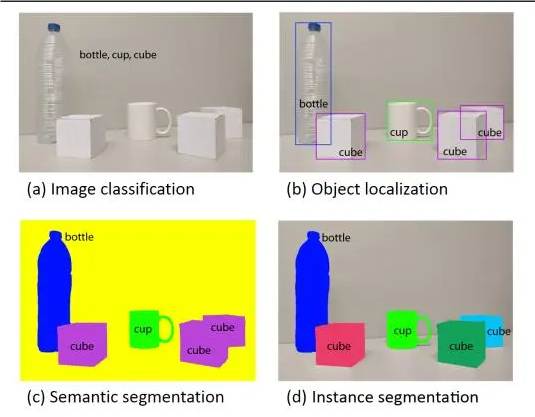

从左向右依次是图像分类，目标检测，语义分割和实例分割。

图像分类是指为输入图像分配类别标签。自 2012 年采用深度卷积网络方法设计的 AlexNet 夺得 ImageNet 竞赛冠军后，图像分类开始全面采用深度卷积网络。2015 年，微软提出的 ResNet 采用残差思想，将输入中的一部分数据不经过神经网络而直接进入到输出中，解决了反向传播时的梯度弥散问题，从而使得网络深度达到 152 层，将错误率降低到 3.57%，远低于 5.1%的人眼识别错误率，夺得了ImageNet 大赛的冠军。

目标检测指用框标出物体的位置并给出物体的类别。2013 年加州大学伯克利分校的 Ross B. Girshick 提出 RCNN 算法之后，基于卷积神经网络的目标检测成为主流。之后的检测算法主要分为两类，一是基于区域建议的目标检测算法，通过提取候选区域，对相应区域进行以深度学习方法为主的分类，如 RCNN、Fast-RCNN、Faster-RCNN、SPP-net 和 Mask R-CNN 等系列方法。二是基于回归的目标检测算法，如 YOLO、SSD 和 DenseBox 等。

图像分割指将图像细分为多个图像子区域。2015 年开始，以全卷积神经网络（FCN）为代表的一系列基于卷积神经网络的语义分割方法相继提出，不断提高图像语义分割精度，成为目前主流的图像语义分割方法。实例分割则是实例级别的语义分割。

本项目主要是图像分类，即给定一张图片，训练模型判断出它的具体类别。

## 配置环境

使用代码之前请先确保电脑上已经安装好了anaconda和pycharm。

### conda加速推荐

```
conda config --add channels https://mirrors.ustc.edu.cn/anaconda/pkgs/main/

conda config --add channels https://mirrors.ustc.edu.cn/anaconda/pkgs/free/

conda config --add channels https://mirrors.bfsu.edu.cn/anaconda/cloud/pytorch/

conda config --set show_channel_urls yes

pip config set global.index-url <https://mirrors.ustc.edu.cn/pypi/web/simple>
```

### 代码环境配置

```      
conda create -n cls-42 python==3.8.5

conda activate cls-42

conda install pytorch==1.10.0 torchvision==0.11.0 torchaudio==0.10.0 cudatoolkit=11.3

cd 自己本地的代码目录 （或者在本地代码目录的上方打开cmd）

pip install -r requirements.txt
```

## 数据集处理

### 数据集收集

数据集一般有两种方式获取，一种可以通过自己拍摄或者是爬虫爬取建立自建的数据集，另外一种是使用公开的数据集，如本项目中所提供的。

对于公开数据集，比如医学分割，我们一般从这个网址获取：

[https://www.isic-archive.com/\#!/onlyHeaderTop/gallery](https://www.isic-archive.com/#!/onlyHeaderTop/gallery)

我们这里提供了一个爬虫的程序，可以帮助大家从百度图片中爬取自己需要的图片，程序的名称是data_get.py，使用起来非常方便，大家直接运行程序之后，属于自己想要爬取的图片即可，这段程序我直接放在这里。

比如这里我想要爬取向日葵的图片，运行之后输入向日葵，然后输入想要爬取的图片数量即可。输入完成之后，爬取之后的图片将会自动保存在data目录下。

```python
# -*- coding: utf-8 -*-
# @Time    : 2024/8/4 22:35
# @File    : get_data.py
# @Software: PyCharm
# @Brief   : 爬取百度图片

import requests
import re
import os

headers = {
    'User-Agent': 'Mozilla/5.0 (Windows NT 10.0; Win64; x64) AppleWebKit/537.36 (KHTML, like Gecko) Chrome/84.0.4147.125 Safari/537.36'}
name = input('请输入要爬取的图片类别：')
num = 0
num_1 = 0
num_2 = 0
x = input('请输入要爬取的图片数量？（1等于60张图片，2等于120张图片）：')
list_1 = []
for i in range(int(x)):
    name_1 = os.getcwd()
    name_2 = os.path.join(name_1, 'data/' + name)
    url = 'https://image.baidu.com/search/flip?tn=baiduimage&ie=utf-8&word=' + name + '&pn=' + str(i * 30)
    res = requests.get(url, headers=headers)
    htlm_1 = res.content.decode()
    a = re.findall('"objURL":"(.*?)",', htlm_1)
    if not os.path.exists(name_2):
        os.makedirs(name_2)
    for b in a:
        try:
            b_1 = re.findall('https:(.*?)&', b)
            b_2 = ''.join(b_1)
            if b_2 not in list_1:
                num = num + 1
                img = requests.get(b)
                f = open(os.path.join(name_1, 'data/' + name, name + str(num) + '.jpg'), 'ab')
                print('---------正在下载第' + str(num) + '张图片----------')
                f.write(img.content)
                f.close()
                list_1.append(b_2)
            elif b_2 in list_1:
                num_1 = num_1 + 1
                continue
        except Exception as e:
            print('---------第' + str(num) + '张图片无法下载----------')
            num_2 = num_2 + 1
            continue
# 为了防止下载的数据有坏图，直接在下载过程中对数据进行清洗
print('下载完成,总共下载{}张,成功下载:{}张,重复下载:{}张,下载失败:{}张'.format(num + num_1 + num_2, num, num_1, num_2))
```

### 数据集清洗

在实际的使用中，opencv对中文的支持并不好，在一些封装好的以opencv作为后端的api中，读取包含中文路径或者名称的图片将会产生一些错误信息，为了方便后续的程序能够正常的进行。我们这里首先需要对数据集进行清洗，清洗的目的有两个：一是去除爬取图片中的坏图，二是将原先中文名称的图片修改为英文。

```python
import shutil
import cv2
import os
import os.path as osp
import numpy as np
from tqdm import tqdm


# 实际的图片保存和读取的过程中存在中文，所以这里通过这两种方式来应对中文读取的情况。
# handle chinese path
def cv_imread(file_path, type=-1):
    cv_img = cv2.imdecode(np.fromfile(file_path, dtype=np.uint8), -1)
    if type == 0:
        cv_img = cv2.cvtColor(cv_img, cv2.COLOR_BGR2GRAY)
    return cv_img


def cv_imwrite(file_path, cv_img, is_gray=True):
    if len(cv_img.shape) == 3 and is_gray:
        cv_img = cv_img[:, :, 0]
    cv2.imencode(file_path[-4:], cv_img)[1].tofile(file_path)


def data_clean(src_folder, english_name):
    clean_folder = src_folder + "_cleaned"
    if os.path.isdir(clean_folder):
        print("保存目录已存在")
        shutil.rmtree(clean_folder)
    os.mkdir(clean_folder)
    # 数据清晰的过程主要是通过oepncv来进行读取，读取之后没有问题就可以进行保存
    # 数据清晰的过程中，一是为了保证数据是可以读取的，二是需要将原先的中文修改为英文，方便后续的程序读取。
    image_names = os.listdir(src_folder)
    with tqdm(total=len(image_names)) as pabr:
        for i, image_name in enumerate(image_names):
            image_path = osp.join(src_folder, image_name)
            try:
                img = cv_imread(image_path)
                img_channel = img.shape[-1]
                if img_channel == 3:
                    save_image_name = english_name + "_" + str(i) + ".jpg"
                    save_path = osp.join(clean_folder, save_image_name)
                    cv_imwrite(file_path=save_path, cv_img=img, is_gray=False)
            except:
                print("{}是坏图".format(image_name))
            pabr.update(1)


if __name__ == '__main__':
    data_clean(src_folder="D:/upppppppppp/cls/cls_torch_tem/data/向日葵", english_name="sunflowers")
```

该程序是data_clean.py文件，使用的时候需要传入两个参数，一个是原始爬取的数据目录，一个是该类别的英文名称。处理之后的好图将会保存在后缀为_cleaned目录的文件下。

### 数据集划分

如果你的数据集中包含了训练集和测试集，则你不需要进行这一步，如果你的数据集中是一整个，则需要进行这一步。

在正式训练之前，你还需要准备好训练集、验证集和测试集，一般是需要将所有的数据按照6:2:2的比例进行划分。这里也为大家准备了data_split.py的脚本帮助大家做数据集的划分。划分之前，请先按照类别将对应的图片放在对应的子目录下，如D:\\2023_pytorch110_classification_42-master\\data\\flowers_5

然后使用data_split.py脚本即可，这里你只需要修改原始数据集的路径，直接运行就可以，之后将会产生一个后缀为_split的目录，里面是按照6：2：2比例划分之后的数据集。

如果你想要修改划分的比例，可以在data_split.py第23行处进行修改，保证他们的和等于1即可。

记住训练集（train）、验证集（val）和测试集（test）的路径，我们将会在后续的训练和测试中经常用到，如D:\\2023_pytorch110_classification_42-master\\data\\flowers_5_split

## 模型训练

训练之前，大家需要设置一些基本信息，标着todo字样的都是大家需要进行修改的，这里我们以Resnet50模型的训练为例。

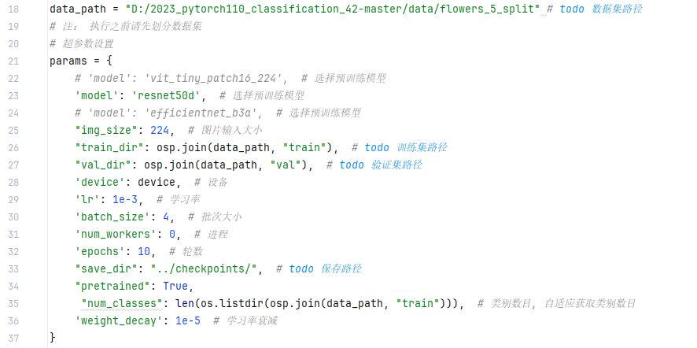

一开始执行之前会有一个会需要下载预训练模型到指定目录，由于众所周知的原因，大家需要提前先把模型下载下来放置到这个目录，这个大家自行探索。

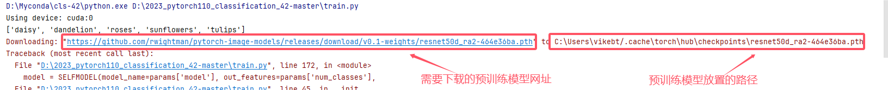

右键直接运行train.py就可以开始训练模型，代码首先会输出模型的基本信息（模型有几个卷积层、池化层、全连接层构成）和运行的记录。

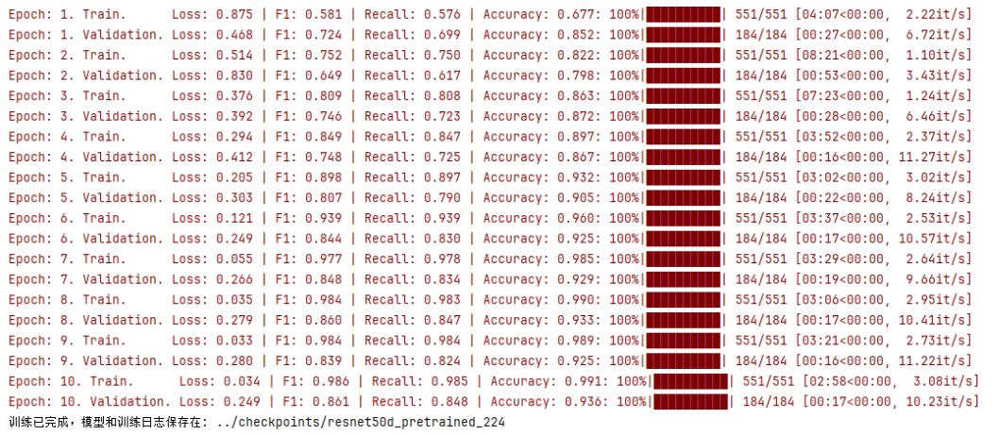

运行结束之后，训练好的模型将会保存在一开始你指定的目录下，保存的逻辑是：如果当前轮的准确率比目前最好的准确率高就会保存。同时，模型训练过程中acc和loss的变化曲线也会保存在指定的保存目录下，如下所示。

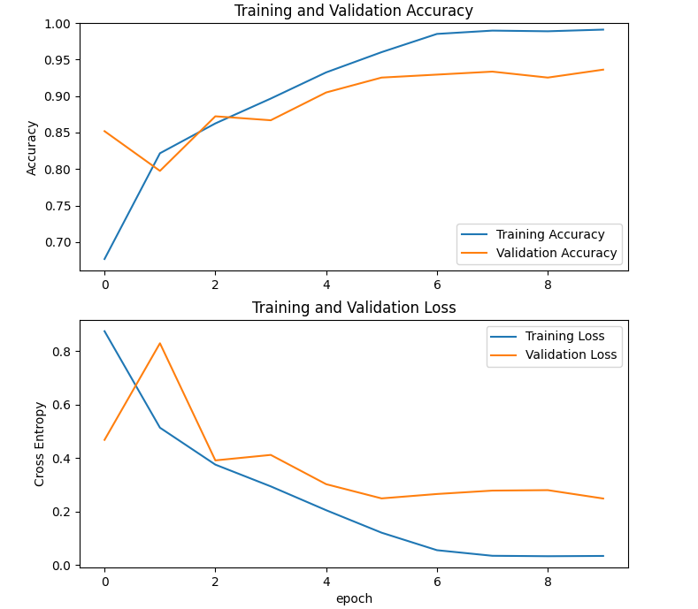

上面的图表示准确率的变化曲线，下面的图表示loss的变化曲线，其中蓝色的为为训练集，橘黄色的为验证集，从图中可以看出，随机训练过程的进行，模型在慢慢收敛直到稳定。

## 模型测试和使用

test.py是模型测试的主程序，在进行模型测试之前，你需要对标注了todo文字所在行的内容进行修改，如下图所示，并且你的测试一定是在训练之后进行的。

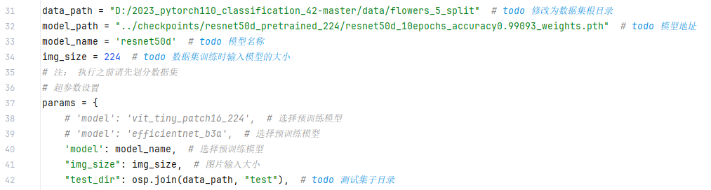

修改完毕之后，右键执行test.py就可以对你指定的模型在测试集上进行测试，测试结束，将会输出模型在数据集上的F1、Recall和ACC等指标，并且会生成由每类分别的准确率构成的热力图保存在record目录下，如下图所示。

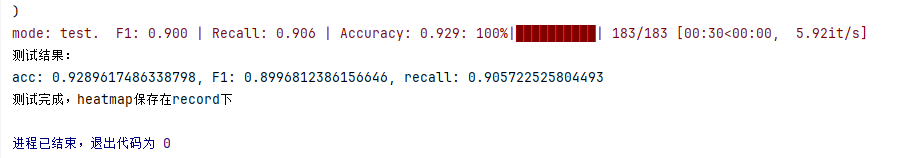

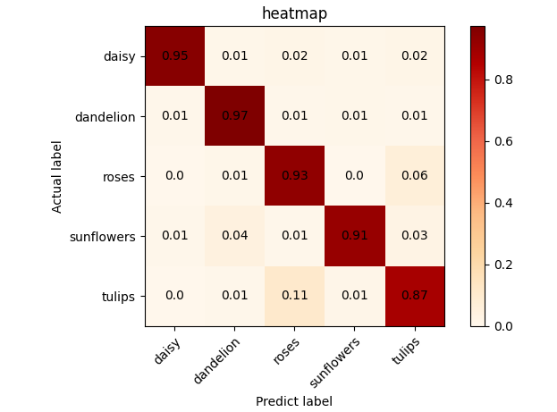

## 模型参数和模型结构查看

为了方便大家对任意的图片进行预测，我这里封装了两个函数，predict_batch函数负责对一个文件夹下的所有图片进行预测，predict_single函数负责对单张图片进行预测。通过这两个函数进行扩展，你可以完成对视频的实时预测，或者是通过HTTP接口应用在你网站上的后端程序等，具体用途需要靠大家发挥想象力了。

模型预测的代码是predict.py文件，该文件中包含了两个函数，分别是文件夹预测和单张图片预测的函数，在实际运行的时候，你需要在main函数中指定具体要执行的是哪个函数。执行之前，需要设置一些基本参数，需要设置的参数我用todo进行了标记，大家按照标记进行修改就可以。

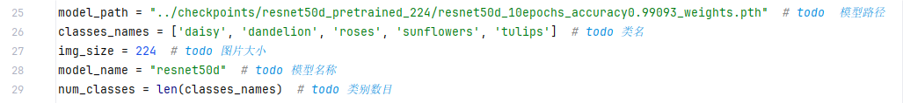

### 预测批量图片类别

对文件夹的图片进行预测的时候，需要传入三个参数，分别是模型地址、需要预测的文件夹的地址、预测结果保存的地址（模型会按照预测结果放在对应的类别文件夹中）

比如对于下面的预测目录D:/2023_pytorch110_classification_42-master/images/test_imgs/mini，我希望结果保存在目录D:/2023_pytorch110_classification_42-master/images/test_imgs/mini_result下。

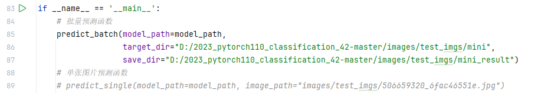

打开mini_result文件夹，可以看到每个图片都按照预测结果放在了不同的文件夹下。

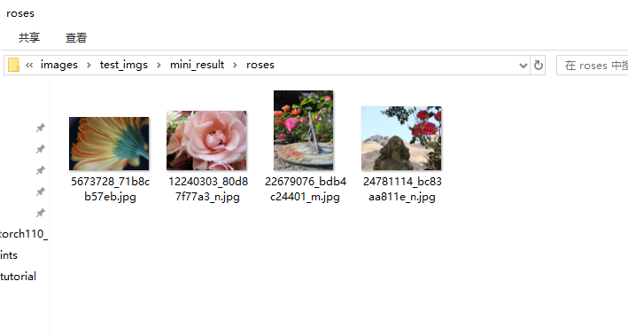

### 预测单张图片类别

比如我要对这样的一张图片进行预测，首先请标注这张图片的路径，后面将会使用到。


接着将图片路径写入predict_single函数，右键直接运行即可，运行效果如下图所示。

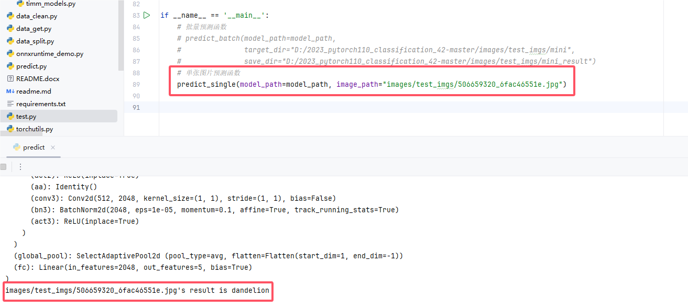

## 模型其他信息查看

### 模型结构查看

一般在论文中，为了让我们的网络看起来方便读一些，我们需要查看网络具体的模型结构，这个时候需要借助netron这个软件，在进行查看之后，需要将我们的模型转换为onnx格式的模型，onnx格式的模型也是后续实际在windows上做模型部署用的形式，这个我们会单独开一个章节来讲。

比如以我们训练好的resnet50模型为例，代码在utils/export_onnx.py，和之前一样，还是需要修改几个固定的参数之后直接右键执行即可，即可得到转换为了onnx格式的模型，然后将模型拖动到netron软件中即可查看具体的网络结构。

### 模型参数量查看

另外，有的时候我们需要查看模型的参数量和计算量，这里的计算量一般用flops来进行表示，但是实际上这里的计算量和fps不是严格意义上相关的，有的时候不一定的是flops低，模型的推理速度就快。模型实际的运行快慢还是需要看fps的，这部分的代码我没有写（一个简单的思路：就是算推理一个文件夹的图片花费了多少s，然后用图片数量除以时间， 就可以算出来fps）。

计算参数量的代码在utils//get_flops.py文件，同样将todo的几个参数修改之后直接运行即可查看。

### 模型更换网格结构

目前本项目支持三种训练模型，如需更换网络结构，则在train.py图示位置进行注释和取消注释操作即可。

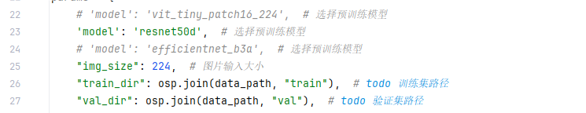

同样的，在test.py中测试模型时，别忘记修改模型名称。


## 图形化界面构建

图形化界面的构建依然通过pyqt5来编写，主要功能还是上传图片和对模型进行推理。

启动界面之前需要设置window.py中几个关键的参数，如下图所示：

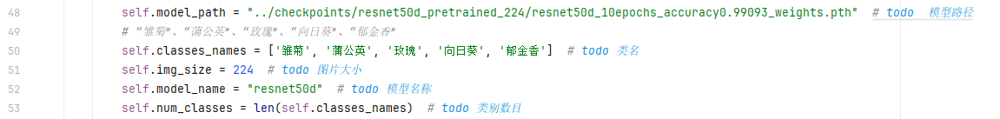

之后，直接启动window.py即可运行。

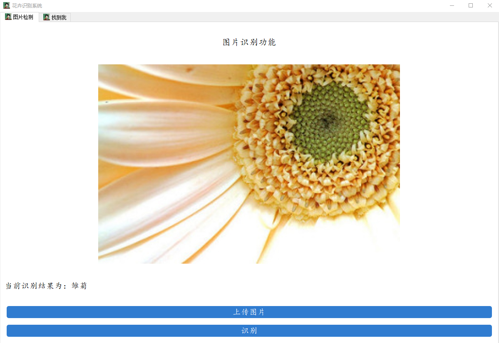

参考链接：<https://blog.csdn.net/ECHOSON/article/details/128130360>
